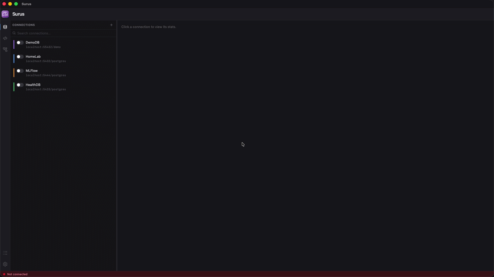

<p align="center">
  
</p>

<h1 align="center">Surus</h1>

<p align="center"><strong>Agentic Postgres companion — with the right guardrails to safely point LLMs at your prod DB.</strong></p>

<p align="center">
  <a href="#features">Features</a> ·
  <a href="#quickstart">Quickstart</a> ·
  <a href="#desktop-app">Desktop app</a>
</p>

<p align="center">
  
</p>

---

## Design

Surus is a Postgres companion client with a built-in agent.
The design philosophy is built around 3 core principles.

**1. Tight Text-to-SQL Loop.**
The agent runs a loop: draft a query -> run `EXPLAIN` -> evaluate the plan, iterate. What lands in your editor has already been fitted and optimized to your data and DB performance.

**2. Read-only by design.** The agent always stays read-only. It runs on a read-only connection pool — writes fail at the database level. You can opt into write mode from the editor to run your own `INSERT`/`UPDATE`/`DELETE`; the agent never touches that pool.

**3. Your data stays private by default.** The agent reasons over schema, table statistics, and `EXPLAIN` plans.

The companion can be run as a local web app or a native MacOS app.

---

## Features

**IDE**
- Modern SQL editor with a results grid, CSV export and one-click data visualization
- Saved queries organized in git friendly directory structure
- Query parameters and selection-only execution

**Agent**
- Tight Text-to-SQL loop that uses query plans and schema stats to optimize queries.
- Anthropic, OpenAI and Google providers with configurable prompts, step/token limits and tool timeouts
- Three chat modes:
  - **SQL:** Turn a plain text request into a performant SQL query
  - **Question:** Answer questions about your data in plain text
  - **Teach:** Build the query, then walk through every clause and why it's written that way
- Schema and stats context is prompt-cached and extension-aware — persistent chat history.
- "Explain with AI" helper for EXPLAIN queries and errors.

**ERD**
- Auto generated ERD diagram with pan, zoom, and drag-to-reposition tables
- Foreign key highlighting, with hover-to-trace relationships between tables
- Filter to related tables only, or search by name and schema

**Logs**
- Full query log tagged by who ran it — you, the agent, or the app
- Duration, row count, and errors tracked per query, color-coded by execution speed
- Filter by level or free text, with auto-scroll and jump-to-latest

---

## Quickstart

**Prerequisites**

- Python ≥ 3.11 and [uv](https://docs.astral.sh/uv/)
- Node ≥ 20 and npm
- Docker — only for the optional demo database

```bash
make setup        # install backend (uv) + frontend (npm) deps
make demo-db      # optional: spin up a demo Postgres in Docker
make dev          # backend :8765 + frontend :5173 → open http://localhost:5173
```

On first launch:

1. **Add a connection** (sidebar `+`). For the demo DB: host `localhost`, port `55432`, database `demo`, user/pass `postgres`.
2. **Set your API key** in the chat settings to enable the agent.

The demo database (`make demo-db`) runs `timescale/timescaledb-ha:pg16` — Postgres 16 with TimescaleDB and PostGIS enabled, seeded with sample tables, so you can see the extension-aware introspection work out of the box. Re-running the target is idempotent.

---

## MacOS app

The same UI and backend ship as a native desktop app — a Tauri v2 shell that spawns the backend as a sidecar on `127.0.0.1:8765` and tears it down on exit.

```bash
make tauri-dev    # native window against the dev backend (hot reload; needs Rust)
make app          # freeze the backend (PyInstaller) + package Surus.app / .dmg
```

`make app` output lands in `build/tauri/release/bundle/`. The bundle is self-contained — it embeds the frozen Python backend and the built frontend, so it runs without the repo, uv, or a system Python. Builds are currently ad-hoc signed and macOS-only; the web app (`make dev`) runs anywhere.

---

## Configuration & data

Everything is stored locally:

- **Connections, saved queries, chat history, settings** live in a single SQLite file: `~/Library/Application Support/Surus/surus.db` on macOS, `%LOCALAPPDATA%\Surus` on Windows, `~/.local/share/Surus` on Linux.
- **Secrets** — DB passwords and LLM API keys — live in the OS keychain under the service name `surus`.

---
